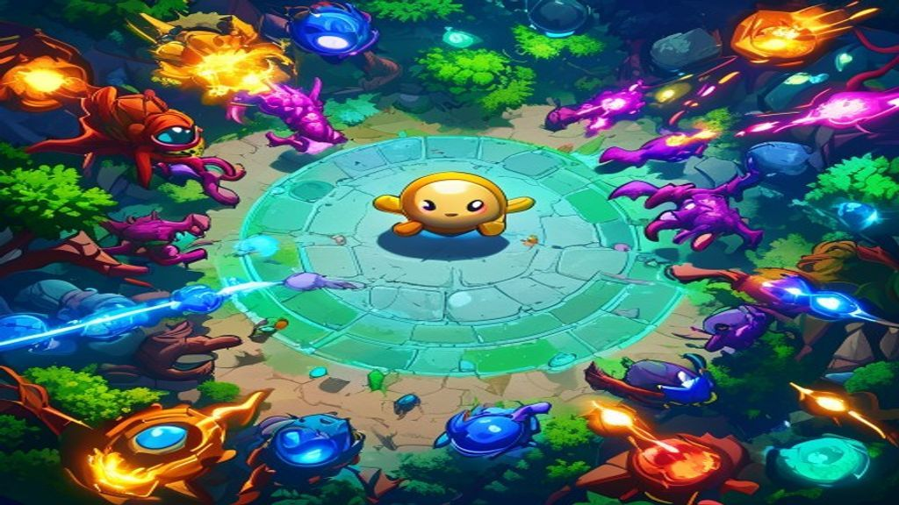

# 💎 Gem Quest — Arena Survival

A **Vampire Survivors-style arena roguelite** built in vanilla HTML5 Canvas + JavaScript, targeting [Crazy Games](https://www.crazygames.com/).

You just move. Weapons fire automatically. Pick up gems to level up, grab coins to buy permanent upgrades, defeat waves of fantasy monsters, and conquer 4 themed stages culminating in a dragon boss.



## 🎮 How to Play

- **Move:** `WASD` or `ZQSD`
- **Aim:** Mouse / touch
- **Weapons fire automatically** — collect gems to level up
- **Pick 1 of 3 items** on every level-up
- **Defeat the boss** in each stage for a lootbox reward
- **Spend coins in the shop** between stages for permanent upgrades
- **Survive long enough** to beat the Dragon in stage 4

## ✨ Features

- 🎯 **One-click gameplay** — auto-attack, just move
- 🗺️ **4 themed stages** — Enchanted Forest → Crystal Caves → Haunted Castle → Dragon's Lair
- 👹 **8 enemy types + 4 unique bosses** (Treant, Golem, Vampire Lord, Dragon)
- 💎 **25+ items** with stacking synergies (Iron Sword, Multi-Shot, Lightning, Vampire Fang, Phoenix Feather, etc.)
- 🎁 **3-tier lootboxes** dropped by bosses (bronze / silver / gold)
- 🛒 **6 permanent shop upgrades** that carry between runs
- 📱 **Mobile support** with on-screen joystick
- ⌨️ **AZERTY + QWERTY** keyboard layouts
- 🔊 **Procedural Web Audio SFX** — no audio files
- 🎨 **Procedural pixel-art sprites** — entire game < 350 KB
- 🤖 **AI-generated backgrounds** for the loading screen and main menu
- 💾 **Persistent progress** via localStorage + CrazyGames SDK

## 🚀 Running Locally

```bash
git clone https://github.com/mertcannrw-ux/Gem-QUest.git
cd Gem-QUest
npm start
# open http://localhost:8080
```

No build step or runtime dependencies. Node.js 20+ is used for the local
server and automated verification.

## ✅ Production Verification

```bash
npm ci
npm run verify
```

`npm run verify` performs JavaScript syntax checks, validates local asset
references, rejects unsafe browser APIs and obsolete SDK calls, enforces the
platform size/file limits, and runs the automated unit + server security tests.
GitHub Actions runs the same command for every pull request and push to `main`.

## 📂 Project Structure

```
Gem-QUest/
├── index.html              Entry point + CrazySDK loader
├── styles.css              Boot screen + 16:9 letterbox
├── serve.js                Tiny Node.js dev server
├── assets/                 AI-generated backgrounds
│   ├── loading.png         Loading screen art
│   ├── menu_bg.png         Main menu background
│   └── menu_bg_alt.png     Alternate menu background
├── js/
│   ├── utils.js            Math, RNG, shake, formatters
│   ├── sdk.js              CrazySDK wrapper (graceful fallback)
│   ├── audio.js            Procedural Web Audio SFX
│   ├── input.js            Keyboard (WASD+ZQSD) + touch joystick
│   ├── particles.js        Typed-array particle system
│   ├── sprites.js          ★ Procedural pixel-art sprite cache
│   ├── assets.js           AI art loader (graceful fallback)
│   ├── data.js             ★ 25+ items, 8 enemies, 4 bosses, 4 stages
│   ├── mechanics.js        RunDirector, elite modifiers, item synergies, world events
│   ├── player.js           Player + auto-attack + item effects
│   ├── enemies.js          Enemy AI + 4 boss patterns
│   ├── items.js            XP gem / coin pickup logic
│   ├── lootbox.js          Boss reward UI
│   ├── stages.js           Wave manager + boss spawner
│   ├── ui.js               Menus, HUD, level-up, shop, game over
│   ├── game.js             Master loop, camera, state machine
│   └── main.js             Boot + save restore
└── HANDOFF.md              Detailed handoff document
```

`★` = largest content files. New content goes here.

## 🏗️ Architecture

### Why procedural sprites (not sprite sheets)?

The 50 MB initial-download budget is generous, but procedural sprites are deliberate for two reasons:
1. **Zero file size** for art — entire game is well under 1 MB total.
2. **Pixel-perfect at any resolution** — `image-rendering: pixelated` means the chunky art stays crisp on any monitor.

If/when you switch to real art:
- Drop PNG sprite sheets into `assets/sprites/`
- Replace `Sprite.get(id).image` lookups with preloaded `Image` objects
- Keep the `Sprite.draw(ctx, id, x, y, opts)` API — only the cache internals change

### Why is `game.js` so big?

It's the master state machine. Possible refactor: split `state` into a dedicated `StateMachine` class with `enter`/`exit`/`update`/`render` per state. Only worth it if you add more states (settings, leaderboard, profile, etc.).

### Module loading order

`index.html` loads JS in this exact order — **don't reorder**:

```
utils.js → sdk.js → audio.js → input.js → particles.js → sprites.js
→ assets.js → data.js → mechanics.js → player.js → enemies.js → items.js → lootbox.js
→ stages.js → ui.js → game.js → main.js
```

### Frame loop safety

The main `loop` is wrapped in `try { update; render; } catch (e) { log }`. This is intentional — **never** let a bug freeze the entire game. A single bad frame logs and moves on.

### Save / restore

- CrazyGames SDK v3 data module with a `localStorage` fallback
- Versioned `saveData` schema containing coins, unlocked stages, and shop levels
- `SDK.save(key, value)` / `SDK.load(key, default)`
- `game.persistMeta()` saves after every death / victory
- `main.js` restores before the first frame

## 🧪 Quick Test Snippets

Open the browser console and try:

```js
// Force a boss spawn
g.enemies = [];
g.stage.bossSpawned = false;
g.stage.waveIdx = 99;
g.stage.waveTime = 999;
g.stage.update(0.016, g);

// Inspect state
JSON.stringify({
  state: g.state,
  stage: g.stage.index,
  wave: g.stage.waveIdx,
  bossSpawned: g.stage.bossSpawned,
  player: { hp: g.player.hp, level: g.player.level, items: g.player.items }
}, null, 2)

// Grant all items (testing)
Object.keys(ITEM_BY_ID).forEach(id => g.player.addItem(id));
```

## 🤝 Contributing

1. Fork the repo
2. Create a feature branch (`git checkout -b feature/amazing-thing`)
3. Commit your changes
4. Push the branch
5. Open a Pull Request

For new content (items, enemies, stages, bosses), start in `js/data.js` — the engine picks it up automatically.

## 📜 License

MIT — do whatever you want, just don't blame us if a slime kills your run.

## 🔒 Security and Deployment

- The included server rejects path traversal and unsupported HTTP methods.
- Production-like CSP, MIME sniffing, referrer, and permissions headers are set
  by `serve.js`.
- The official CrazyGames HTML5 SDK v3 URL and APIs are used.
- Rewarded rewards are granted only after the SDK reports `adFinished`.
- For release, host the static files on CrazyGames or behind a maintained HTTPS
  CDN; `serve.js` is intentionally a small local preview server.

## 🎮 Made With

- Vanilla JavaScript (ES2020+)
- HTML5 Canvas 2D
- Web Audio API
- A lot of `fillRect()` calls
- AI-generated art via [Pollinations.ai](https://pollinations.ai/) (Flux model)
